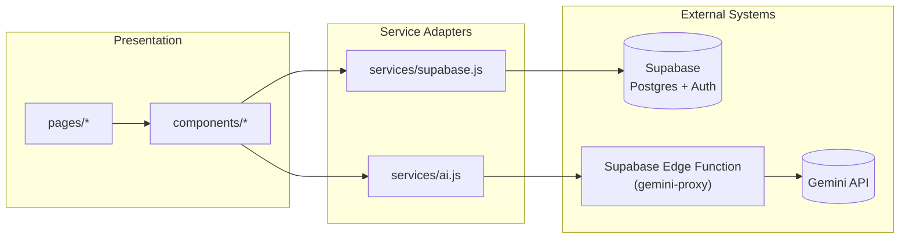
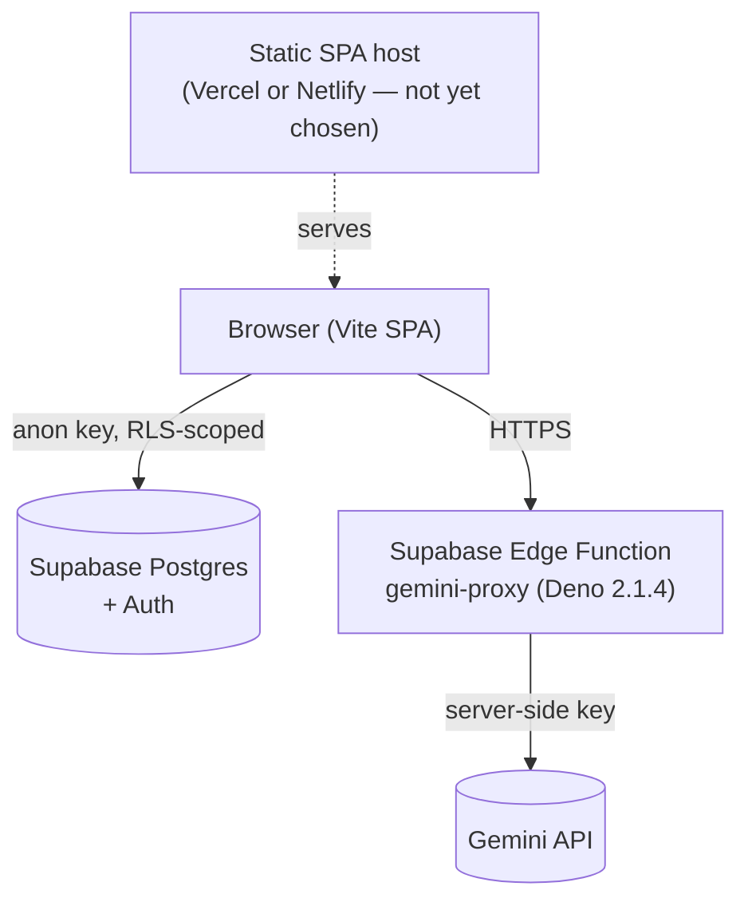

# Architecture Spine — Vibe Hub

## Design Paradigm

**Thin layered architecture**, three layers, one direction of dependency:

1. **Presentation** — `src/pages/`, `src/components/` (React function components, local `useState` only).
2. **Service Adapters** — `src/services/*.js`. The *sole* gateway to every external system. A component never imports an external SDK directly.
3. **External Systems** — Supabase (Postgres + Auth), a new Supabase Edge Function (Gemini proxy), Gemini itself.

This ratifies what the codebase mostly already does (`services/supabase.js`, `services/ai.js`) and closes the one place it doesn't (AdminPage importing the raw Supabase client for auth — AD-2).



## Invariants & Rules

### AD-1 — Gemini calls never run client-side

- **Binds:** FR-5 (IA chat), FR-7 (UI Builder)
- **Prevents:** the Gemini API key shipping in the browser bundle (current state: `VITE_GEMINI_API_KEY` is inlined by Vite and extractable from devtools — an open abuse/cost vector the PRD itself flags as rising, not static)
- **Rule:** all Gemini calls go through a Supabase Edge Function (`gemini-proxy`, Deno runtime, built on `@google/genai` — see Stack). `services/ai.js` calls the Edge Function over HTTPS, never a Gemini SDK directly from the browser. The Gemini key lives only in Edge Function server-side env, never in a `VITE_`-prefixed variable.
- **Status (branch `fix/ad-1-gemini-proxy`):** ✅ satisfied in code. `services/ai.js` is now a single `fetch()` to `env.geminiProxyUrl` (`{ history, systemInstruction }` → `{ text } | { error, status? }`); the `@google/generative-ai` dependency is removed; the only client-side env var is `VITE_GEMINI_PROXY_URL` (public). Remaining operational work: deploy `gemini-proxy`, set `GEMINI_API_KEY` + `ALLOWED_ORIGINS` secrets, wire `VITE_GEMINI_PROXY_URL` on Vercel, revoke the previously-inlined key.

### AD-2 — Service Adapters are the only importers of external SDKs

- **Binds:** all
- **Prevents:** a component reaching around the adapter layer (today: `AdminPage.jsx` imports the raw `supabase` client for `auth.signInWithPassword` / `auth.onAuthStateChange` / `auth.signOut`, bypassing `services/supabase.js`)
- **Rule:** only files under `src/services/` import `@supabase/supabase-js` or call the Edge Function/Gemini. `services/supabase.js` gains `signIn`, `signOut`, `getSession`, `onAuthStateChange` wrappers; `AdminPage.jsx` is updated to use them instead of the raw client.

### AD-3 — Write authority on `courses` and `waitlist` is enforced by Postgres RLS, not client logic

- **Binds:** FR-4, FR-8, FR-9
- **Prevents:** the admin gate being "hide the route and hope" (PRD is explicit this is unacceptable) — a valid anon key could otherwise write `courses` directly regardless of what the React UI shows
- **Rule:** RLS policies on `courses`: anon/public role — `SELECT` only where `published = true`; authenticated admin role — full CRUD. On `waitlist`: anon/public — `INSERT` only, no `SELECT`; **admin role receives no `SELECT` grant on the `waitlist` table itself, under any FR** — the only admin read path is AD-4's `waitlist_counts` view. A story implementing FR-8 (waitlist join) must not add an admin `SELECT` policy on `waitlist` as a side effect of "finishing the feature" — that grant belongs solely to FR-9/AD-4. Client-side session checks in `AdminPage.jsx` remain UX-only convenience, never the security boundary.

### AD-4 — Waitlist demand is read through an aggregate, not raw rows

- **Binds:** FR-9
- **Prevents:** the admin surface needing (and RLS granting) raw read access to individual waitlist emails just to show a count — a wider grant than the feature needs
- **Rule:** `waitlist_counts` is a plain (security-invoker, the Postgres default) view over `waitlist`, grouped by `tool_id` — **not** a `SECURITY DEFINER` function, which would bypass RLS and grant broader access than intended. Admin-role RLS grants `SELECT` on the view only, never on `waitlist` itself (see AD-3). Exposed via a new `getWaitlistCounts()` in `services/supabase.js`.

### AD-5 — AI-generated code renders only inside an isolated sandbox

- **Binds:** FR-7
- **Prevents:** Gemini's output (untrusted input, even though the user prompted it) being `eval`'d or injected directly into the app's own DOM/React tree — an XSS-equivalent risk the current mock sidesteps only because it fakes the output
- **Rule:** generated code renders inside a sandboxed `<iframe>` (`srcdoc`, no access to the parent window/app state). The exact in-browser transform/runtime is implementation detail (Deferred) — the isolation boundary is what's fixed here.

### AD-6 — Two persistence tiers, no third without amending this rule

- **Binds:** FR-3, FR-6, FR-8, FR-9 (data-shape side)
- **Prevents:** a feature inventing its own ad-hoc storage (`sessionStorage`, `IndexedDB`, a new global store) and fragmenting where "state" lives
- **Rule:** durable/shared data (`courses`, `waitlist`) lives in Supabase, reached only via `services/supabase.js` (AD-2). Ephemeral, per-browser, non-authoritative UI state (Course Progress per FR-3; IA tab sessions/projects/skills, already true today) lives in `localStorage` under feature-prefixed keys (`ai_*`, `progress_*`). No global state manager (Redux/Zustand/Context-as-store) is introduced — component-local `useState` stays the pattern.

## Post-v1 Amendments

### PVA-1 — Workspace authentication, progressive gate (2026-09-10)

Resolves the "Full user authentication (v2)" item below, scoped to the Notification Center
(`epics-notifications.md`, Epic 7/8/9).

- **Decision:** real Supabase Auth on the Workspace, applied as a **progressive gate** —
  `/app` stays open for anonymous browsing exactly as today (Modules/IA/Outils unaffected,
  FR-1 / Story 1.2 unchanged). Only per-user features — notifications, preferences, persistent
  progress — require sign-in. An unauthenticated visitor hitting one of these sees a sign-in
  affordance/prompt, never an error.
- **Binds:** FR-10..FR-17, NFR6 (per-user isolation).
- **Extends AD-2:** the Workspace and `/admin` converge on one auth adapter — the existing
  `signIn`/`signOut`/`getSession`/`onAuthChange` wrappers in `services/supabase.js`, now joined
  by `signUp`/`getCurrentUser`. No component calls `supabase.auth.*` directly.
- **Extends AD-6:** notification data is durable/shared (Supabase, RLS-scoped per user) or,
  when Supabase isn't configured, a `localStorage` demo fallback under `notif_*` keys — same
  two-tier split, no third tier.
- **New invariants (AD-7..AD-10)**, see `epics-notifications.md` Requirements Inventory:
  AD-7 (notification data reached only via `services/supabase.js`, cross-tree access via the
  non-store `useNotifications` hook), AD-8 (notification generation — email, reminders, event
  triggers — server-side only: Edge Functions / `pg_cron` / `security definer` triggers, never
  client-side `insert`), AD-9 (live badge updates via Supabase Realtime `postgres_changes`,
  wrapped in the service layer, polling fallback when unconfigured), AD-10 (`snake_case`
  columns, `uuid` ids, `created_at DESC` sanctioned specifically for the notification feed).
- **Status (2026-09-11):** schema + RLS live in production (`0003_notifications.sql`,
  hardened by `0004_notifications_hardening.sql`); client wrappers, hook, and UI implemented
  and tested, including sign-up (with the email-confirmation-required path handled) and a
  Workspace-wide "Se connecter"/"Se déconnecter" entry point in the sidebar (Story 7.1). Only
  the server-side generators (Stories 9.4-9.6) remain open — see `sprint-status.yaml`.

## Consistency Conventions

| Concern | Convention |
| --- | --- |
| Naming (entities, files, interfaces, events) | Feature-folders under `components/` (`landing/`, `workspace/tabs/`, `workspace/modules/`); one `services/<external-system>.js` per external system, camelCase exported functions matching the operation (`getCourses`, `addToWaitlist`, `getWaitlistCounts`) |
| Data & formats (ids, dates, error shapes) | Supabase rows: `snake_case` columns, UUID/serial `id`. **`order_index` is the sole canonical ordering everywhere a course list is shown** (public Modules tab, admin dashboard) — `created_at` is a timestamp only, never a sort key; `getCourses`/`getAllCourses` already do this correctly, ratified as the fixed rule. Service functions **throw** on Supabase/Postgres error by default (existing pattern); a function returns a `{ success } / { duplicate } / { error }` shape instead *only* where the caller must branch on a specific expected, non-error outcome (existing pattern: `addToWaitlist`'s duplicate case) — this is the one sanctioned exception, not a second general style; no service function introduces a third error-handling shape. |
| IA tab session/project reference direction (AD-6 scope) | A chat session object holds `projectId` (session → project, one-way), never the reverse (a project holding a list of session ids) — ratifies the existing `IATab.jsx` shape. Any new FR-5/FR-6 work groups sessions by filtering on `projectId`, never by traversing from a project's own session list. |
| State & cross-cutting (mutation, errors, logging, config, auth) | See AD-6 for persistence tiers. Auth session state is read only through `services/supabase.js` wrappers (AD-2), never `supabase.auth.*` inline in a component. `VITE_`-prefixed env vars are browser-exposed by Vite's design — never put a secret behind one (AD-1's whole point); non-`VITE_` vars are Edge-Function-only. |

## Stack

| Name | Version |
| --- | --- |
| React | 18.3.1 |
| Vite | 5.4.0 |
| Tailwind CSS | 3.4.7 |
| @supabase/supabase-js | 2.104.1 |
| @google/generative-ai | 0.24.1 — **deprecated by Google**, superseded by `@google/genai`. The current browser usage is retired per AD-1 anyway; the new `gemini-proxy` Edge Function must be built on **`@google/genai` (v2.15.0, web-verified 2026)**, not this deprecated package. |
| react-markdown / remark-gfm | 10.1.0 / 4.0.1 |
| lucide-react | 0.383.0 |
| Supabase Edge Functions runtime | Deno 2.1.4 — this is **Supabase's pinned Edge Runtime version** (web-verified 2026), not Deno's own latest mainline (~2.9.x by mid-2026); pin to whatever Supabase's hosted runtime uses, don't chase upstream Deno independently. |

## Structural Seed

```text
src/
  pages/              # route-level composition (LandingPage, WorkspacePage, AdminPage)
  components/
    landing/           # Landing Page sections (FR-1)
    workspace/
      tabs/             # ModulesTab, IATab, OutilsTab (one per Workspace tab)
      modules/           # CourseCard, CourseDetail
  services/            # sole gateway to external systems (AD-2)
    supabase.js          # courses, waitlist, auth wrappers
    ai.js                 # calls the gemini-proxy Edge Function (AD-1)
  hooks/               # useTypewriter etc.
  data/                # legacy: courses.js (retired per FR-2, not a source of truth)

supabase/
  functions/
    gemini-proxy/       # Edge Function (Deno) — holds the Gemini key server-side (AD-1)
  migrations/           # NEW — RLS policies (AD-3) and waitlist_counts view/RPC (AD-4) belong here;
                         # none exist in the repo today, so today's schema/policies are unverified from code
```



## Capability → Architecture Map

| Feature / FR | Lives in | Governed by |
| --- | --- | --- |
| FR-1 Landing page | `pages/LandingPage.jsx`, `components/landing/*` | Paradigm (Presentation only, no adapter needs) |
| FR-2 Real course content | `services/supabase.js` (`getCourses`), `components/workspace/tabs/ModulesTab.jsx` | AD-2, AD-6 |
| FR-3 Session-local progress | new: component-local state + `localStorage` | AD-6 |
| FR-4 Admin gate | `pages/AdminPage.jsx`, `services/supabase.js` auth wrappers, RLS policies | AD-2, AD-3 |
| FR-5 Chat → prompt hand-off | `services/ai.js`, `components/workspace/tabs/IATab.jsx` | AD-1, AD-2 |
| FR-6 Slash commands / projects | `components/workspace/tabs/IATab.jsx`, `localStorage` | AD-6 |
| FR-7 UI Builder | `services/ai.js`, `supabase/functions/gemini-proxy`, new sandboxed preview component | AD-1, AD-5 |
| FR-8 Waitlist join | `services/supabase.js` (`addToWaitlist`) | AD-2, AD-3 |
| FR-9 Waitlist count view | new: `services/supabase.js` (`getWaitlistCounts`), `waitlist_counts` view/RPC, `AdminPage.jsx` | AD-2, AD-3, AD-4 |

## Deferred

- **Sandbox transform/runtime for FR-7** (AD-5 fixes the isolation boundary, not the library). Web-verified 2026-08-06: Sandpack (CodeSandbox) is no longer actively maintained as of March 2026; `react-live`'s latest release (4.1.8) is ~2 years stale. Neither is a safe new dependency to pin here. Resolve at implementation time against the then-current landscape (candidates to re-evaluate: `@babel/standalone` + hand-rolled iframe transform, or whatever has emerged as the maintained option).
- **SPA host: Vercel vs Netlify** — user deferred; either satisfies AD-1/AD-3 identically since both are static hosts with no server responsibility. Pick at deploy time.
- **Existing Supabase schema/RLS state** — no migration files exist in the repo; AD-3/AD-4 describe the target state, not a verified current state. First implementation step for FR-4/FR-9 must audit the live Supabase project's actual policies before assuming a clean slate.
- **Full user authentication (v2)** — explicitly out of MVP scope per PRD §6.2; this spine's AD-6 persistence split (Supabase vs localStorage) is designed so that promoting Course Progress and IA-tab sessions from `localStorage` to per-user Supabase rows later is additive, not a rewrite — but the actual v2 auth model itself is undecided and out of this spine's scope. **Resolved for the Notification Center scope by PVA-1** (progressive gate) — Course Progress / IA-tab promotion to per-user rows remains deferred beyond that.
- **Rate limiting / cost ceiling on Gemini usage** — PRD Constraints (§8) flags this as needed before SM-1 is actively optimized against; the Edge Function (AD-1) is the natural enforcement point once a limit is defined, but no limit is defined yet.
- **Observability/logging** — no logging/monitoring convention exists in the codebase or PRD; not decided here, flagged as an open dimension for whoever builds the Edge Function.
- **Vite 5.4.0 / Tailwind 3.4.7 version debt** (web-verified 2026-08-06) — Vite 5.4.0 is outside the currently-backported security-patch set (6.4/7.3/8.0/8.1 are patched; current major is 8.x), and Tailwind v4 is now the default for new work. Neither is architecturally load-bearing (Vite is build-time only; Tailwind's utility-class usage here doesn't lean on v4-only features) — a version bump is implementation housekeeping, not a spine decision, but shouldn't be silently ignored indefinitely.
